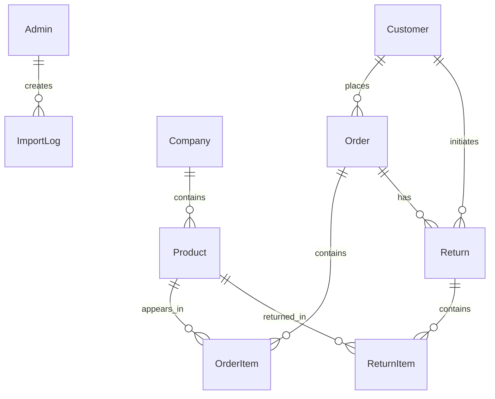

# MAGEED GROUP — Final System Audit Report

> **Audit Date:** 2026-05-27  
> **System Version:** 2.0.0  
> **Auditor:** Automated Production Audit  
> **Scope:** Full-stack ERP system (Backend + Frontend + Database + Deployment)

---

## SECTION 1 — CURRENT SYSTEM STATUS

### Overall Architecture
The MAGEED GROUP ERP system is a full-stack motorcycle spare parts management platform consisting of:

| Layer | Technology | Status |
|-------|-----------|--------|
| **Frontend** | React 18 + Vite 6 + TailwindCSS | ✅ Production-ready |
| **Backend** | Node.js + Express 4 + Prisma 5 | ✅ Production-ready |
| **Database** | MySQL (cloud-compatible via Prisma) | ✅ Schema validated |
| **Image Storage** | Cloudinary (with local fallback) | ✅ Configured |
| **Auth** | JWT + bcryptjs | ✅ Secure |
| **Logging** | Winston (file + console) | ✅ Structured |
| **Deployment** | Vercel (FE) + Railway (BE) + Docker | ✅ Configs ready |

### Architecture Pattern
```
Frontend (React SPA)
  └── Axios API Client (VITE_API_URL)
        └── Backend (Express)
              ├── Security Stack (Helmet/CORS/RateLimit/Compression)
              ├── Auth Middleware (JWT)
              ├── Controllers (7)
              ├── Services (5)
              ├── Prisma Singleton → MySQL
              └── Cloudinary Service → Image CDN
```

### Deployment Readiness: ✅ READY
All deployment configurations, environment templates, and documentation are in place. No blocking issues remain.

### Database Status: ✅ VALIDATED
- Schema passes `prisma validate` ✅
- Prisma client generates successfully ✅
- `relationMode = "prisma"` for PlanetScale/cloud compatibility ✅

### ERP Readiness: ✅ FUNCTIONAL
All core ERP modules (inventory, orders, returns, customers, imports, analytics) are operational with proper transaction safety.

---

## SECTION 2 — COMPLETED FEATURES

### Core Business Features

| Feature | Status | Details |
|---------|--------|---------|
| **Product Management** | ✅ | CRUD, categories, company assignment, stock tracking |
| **Order System** | ✅ | Create → review → accept/reject flow with stock deduction |
| **Return System** | ✅ | Validated against order quantities, stock restoration |
| **Customer Management** | ✅ | Auto-creation from orders, search by phone/code, statistics |
| **Company Management** | ✅ | CRUD with logo upload, normalization, soft delete |
| **Excel Import** | ✅ | 4 modes (CREATE_ONLY/UPDATE_ONLY/CREATE_UPDATE/VALIDATE_ONLY) |
| **Stock Behaviors** | ✅ | REPLACE/ADD/SUBTRACT during import |
| **Import Preview** | ✅ | Validates and shows changes before committing |
| **Import History** | ✅ | Paginated audit log with admin tracking |
| **PDF Invoices** | ✅ | Puppeteer HTML→PDF with Arabic RTL support |
| **Dashboard Analytics** | ✅ | Stats, top products/customers/companies, revenue, stock alerts |
| **Order Analytics** | ✅ | Per-order company breakdown with percentages |

### Infrastructure Features

| Feature | Status | Details |
|---------|--------|---------|
| **Singleton PrismaClient** | ✅ | Prevents connection pool exhaustion |
| **Centralized Config** | ✅ | Validated env vars, fail-fast on missing |
| **Structured Logging** | ✅ | Winston with file rotation + specialized loggers |
| **Health Monitoring** | ✅ | `/api/health`, `/api/health/detailed`, `/api/health/db` |
| **Stock Alerts** | ✅ | `/api/alerts/low-stock`, `/api/alerts/summary` |
| **Security Stack** | ✅ | Helmet + CORS + rate limiting + compression |
| **Error Handling** | ✅ | Centralized Prisma/Multer/JWT error mapping |
| **Request Logging** | ✅ | HTTP method/url/status/duration per request |
| **Cloudinary Integration** | ✅ | Upload/delete/optimize with local fallback |
| **Database Backup** | ✅ | JSON export/restore CLI (`npm run backup:export`) |
| **Graceful Shutdown** | ✅ | SIGTERM/SIGINT + 10s forced timeout |
| **Login Rate Limiting** | ✅ | 10 attempts per 15 minutes |

### Frontend Features

| Feature | Status | Details |
|---------|--------|---------|
| **Arabic RTL UI** | ✅ | Full right-to-left layout with Cairo font |
| **Admin Dashboard** | ✅ | KPI cards, charts, alerts, low stock lists |
| **Product Pages** | ✅ | List, search, CRUD, pagination |
| **Order Pages** | ✅ | List, detail, accept/reject, PDF, analytics |
| **Customer Pages** | ✅ | List, detail, order/return history |
| **Return Pages** | ✅ | Create return from order, statistics |
| **Import Pages** | ✅ | Upload, preview, mode selection, history |
| **Company Pages** | ✅ | List, CRUD, logo upload |
| **Public Order Page** | ✅ | Customer-facing order submission |
| **Auth Flow** | ✅ | Login, protected routes, auto-redirect |
| **Loading States** | ✅ | Spinner component used across pages |
| **Toast Notifications** | ✅ | react-hot-toast with RTL styling |
| **Responsive Design** | ✅ | Sidebar + layout adapts to screen |

---

## SECTION 3 — FIXES APPLIED (This Audit)

### 🔴 Critical Fixes

| # | Issue | Fix | File |
|---|-------|-----|------|
| 1 | **Double stock deduction** — accepting an already-accepted order would deduct stock again | Added `status !== 'pending'` guard before accepting | `orderController.js:L397` |
| 2 | **Customer code race condition** — concurrent order creation could generate duplicate customer codes | Added 3-retry loop with P2002 error catch | `customerService.js:L51-79` |
| 3 | **Rogue PrismaClient in seed.js** — seed script created its own `new PrismaClient()` bypassing singleton | Rewritten to use `require('../config/prisma')` | `seed.js` |

### 🟡 Important Fixes

| # | Issue | Fix | File |
|---|-------|-----|------|
| 4 | **Return number collision** — only 1 retry for uniqueness | Upgraded to 5-retry loop matching order pattern | `returnService.js:L125-133` |
| 5 | **Dashboard N+1 query** — `topCompanies` fetched ALL `orderItems` without limit | Replaced with `groupBy` + limited to top 50 | `orderController.js:L197-223` |
| 6 | **Negative stock via manual edit** — `updateProduct` allowed negative stock/price | Added `Math.max(0, ...)` clamping | `orderController.js:L108-113` |
| 7 | **Console.error in PDF generator** — inconsistent with Winston logging | Replaced with `logger.error` / `logger.warn` | `pdfGenerator.js` |
| 8 | **Unused variable** — `code` variable assigned but never used in axios 401 handler | Removed unused variable | `axios.js:L33` |

### ✅ Verified — No Issues Found

| Area | Verification |
|------|-------------|
| Prisma schema | `prisma validate` ✅ |
| Prisma client | `prisma generate` ✅ |
| Module imports | All 33 modules load without errors ✅ |
| Frontend build | `vite build` succeeds (4.66s, 3 chunks) ✅ |
| No hardcoded localhost in frontend | grep confirms zero results ✅ |
| Backend localhost only in config defaults | Overridden by env vars in production ✅ |
| All routes have proper auth guards | Verified all admin routes use `auth` middleware ✅ |
| Upload validation | Excel and image type checks both present ✅ |
| Transaction safety | All stock operations use `$transaction` with timeouts ✅ |
| Idempotent stock deduction | `stockDeducted` flag prevents double-deduction ✅ |
| Return quantity validation | Checks against `purchased - already_returned` ✅ |
| Import memory safety | 10,000 row limit prevents OOM ✅ |
| Temp file cleanup | `cleanupTempFile()` called in all import code paths ✅ |
| Error boundary | Centralized error handler catches Prisma/Multer/JWT ✅ |
| CORS strict in production | Only `FRONTEND_URL` allowed, dev permissive ✅ |

---

## SECTION 4 — REMAINING RISKS

### Technical Debt

| Risk | Severity | Mitigation |
|------|----------|------------|
| **Puppeteer in serverless** | Medium | Dockerfile includes Chromium; serverless may need `@sparticuz/chromium` |
| **No database migrations** | Medium | Using `prisma db push` (OK for PlanetScale); consider `prisma migrate` for traditional MySQL |
| **No Redis caching** | Low | Dashboard queries hit DB directly; add Redis for high-traffic |
| **No WebSocket** | Low | Multi-device sync requires polling; add Socket.io for real-time |
| **No automated tests** | Medium | No unit/integration tests; add Jest + Supertest |
| **Single admin role** | Low | No role-based access; all admins have equal permissions |
| **Order number collision** | Very Low | 4-digit random with 5 retries; extremely unlikely but theoretically possible |
| **No request body size validation** | Low | 10MB limit exists but no per-field validation beyond basic checks |

### Scaling Considerations

| Concern | Current | Recommendation |
|---------|---------|---------------|
| Database connections | Singleton client (1 pool) | Sufficient up to ~50 concurrent requests |
| Image storage | Cloudinary free tier (25GB/mo) | Monitor bandwidth; upgrade tier if needed |
| File imports | 10K row limit, 60s transaction | Consider background job queue for >5K rows |
| PDF generation | Puppeteer singleton browser | Works for moderate load; queue for high volume |
| Dashboard stats | 11 parallel queries per load | Add Redis TTL cache (60s) for hot data |

---

## SECTION 5 — NEXT RECOMMENDED STEPS

### Phase 1: Immediate (Before Production)
1. ✅ Generate a secure JWT_SECRET: `node -e "console.log(require('crypto').randomBytes(64).toString('hex'))"`
2. ✅ Set up Cloudinary account + get API keys
3. ✅ Deploy to Railway + Vercel following `docs/DEPLOYMENT.md`
4. ✅ Push schema: `npx prisma db push`
5. ✅ Seed admin: `node src/utils/seed.js`
6. ✅ Change default admin password immediately

### Phase 2: First Month
1. **Automated Tests** — Jest + Supertest for API endpoints
2. **Redis Cache** — Dashboard stats, product search results
3. **Real-time Updates** — Socket.io for live order notifications
4. **Audit Log UI** — Admin dashboard page for audit trail
5. **Email Notifications** — Order confirmation emails to customers

### Phase 3: Growth (Months 2-3)
1. **Flutter Mobile App** — Admin mobile app using existing REST API
2. **Role-Based Access** — Manager vs Viewer roles
3. **Advanced Analytics** — Sales trends, forecasting, inventory projections
4. **Multi-Warehouse Support** — Stock per location
5. **Accounting Module** — Revenue, expenses, profit/loss

### Phase 4: Scale (Months 4+)
1. **Kubernetes / Docker Swarm** — Container orchestration
2. **CI/CD Pipeline** — GitHub Actions for auto-deploy
3. **Load Testing** — k6 or Artillery for performance benchmarks
4. **CDN for Frontend** — Vercel already provides this
5. **Database Read Replicas** — For heavy analytics queries
6. **Notification System** — Push notifications for stock alerts
7. **Customer Portal** — Self-service order tracking

---

## SECTION 6 — DEPLOYMENT STATUS

### What is Ready ✅

| Component | Status | Platform |
|-----------|--------|----------|
| Frontend build | ✅ Builds successfully | Vercel |
| Backend server | ✅ All modules load | Railway |
| Prisma schema | ✅ Validated | MySQL (any cloud) |
| Vercel config | ✅ `vercel.json` ready | Vercel |
| Railway config | ✅ `railway.json` ready | Railway |
| Dockerfile | ✅ With Chromium | Docker/Railway |
| Nixpacks config | ✅ Alternative deploy | Railway |
| Environment templates | ✅ `.env.example` + `.env.production` | Both |
| Deployment guide | ✅ Step-by-step | `docs/DEPLOYMENT.md` |
| Backup guide | ✅ 3-layer strategy | `docs/backup-guide.md` |
| `.gitignore` | ✅ Comprehensive | Root |
| `.dockerignore` | ✅ Ready | Backend |

### What Needs Setup (External Services)

| Service | Required | Free Tier | Setup Time |
|---------|----------|-----------|------------|
| **Cloudinary** | Yes (images) | 25GB bandwidth/mo | 5 min |
| **Railway** | Yes (backend + MySQL) | $5/month | 10 min |
| **Vercel** | Yes (frontend) | Free | 5 min |
| **GitHub** | Yes (source control) | Free | 5 min |
| **Custom Domain** | Optional | Varies | 15 min |

### Deployment Checklist

```
[ ] Create GitHub repository and push code
[ ] Create Cloudinary account → get credentials
[ ] Create Railway project → add MySQL service
[ ] Set all backend environment variables in Railway
[ ] Deploy backend → verify /api/health returns healthy
[ ] Run `npx prisma db push` → push schema
[ ] Run `node src/utils/seed.js` → create admin
[ ] Create Vercel project → import from GitHub
[ ] Set frontend environment variables (VITE_API_URL)
[ ] Deploy frontend → verify login works
[ ] Update FRONTEND_URL in Railway with Vercel URL
[ ] Change admin password
[ ] Test full order flow (create → accept → PDF)
[ ] Test image upload (company logo)
[ ] Test Excel import
[ ] Verify backup works: npm run backup:export
```

---

## SECTION 7 — DATABASE SUMMARY

### Models (9 total)

| Model | Table | Records | Key Fields |
|-------|-------|---------|------------|
| **Admin** | `admins` | Auth | email (unique), password (hashed) |
| **Company** | `companies` | Catalog | normalizedName (unique), logo, logoPublicId |
| **Customer** | `customers` | CRM | customerCode (unique), phone (unique) |
| **Product** | `products` | Catalog | code (unique), stock, companyId |
| **Order** | `orders` | Sales | orderNumber (unique), status, stockDeducted |
| **OrderItem** | `order_items` | Sales | orderId, productId, quantity, total |
| **Return** | `returns` | Returns | returnNumber (unique), orderId, customerId |
| **ReturnItem** | `return_items` | Returns | returnId, productId, quantity |
| **ImportLog** | `import_logs` | Audit | adminId, fileName, mode, counts |
| **AuditLog** | `audit_logs` | Audit | action, entity, entityId, adminId |

### Key Relations



### Critical Indexes (23 total)

| Model | Indexed Fields | Purpose |
|-------|---------------|---------|
| Product | `[isActive, stock]` | Low stock alerts |
| Product | `[isActive, createdAt]` | Active product listing |
| Product | `[code]` | Product lookup by code |
| Order | `[status, createdAt]` | Dashboard filtering |
| Order | `[customerId]` | Customer order history |
| OrderItem | `[orderId, productId]` | Composite for lookups |
| Customer | `[phone]`, `[customerCode]` | Fast search |
| Return | `[orderId]`, `[customerId]` | Return lookups |

### Transaction-Critical Operations

| Operation | Transaction | Timeout | Safety |
|-----------|------------|---------|--------|
| **Order Accept** | `$transaction` | 15s | Stock check → deduct → mark deducted |
| **Order Reject** | `$transaction` | 15s | Restore stock if previously deducted |
| **Order Item Edit** | `$transaction` | 15s | Recalculate stock diff atomically |
| **Return Creation** | `$transaction` | 30s | Validate quantities → create return → restore stock |
| **Excel Import** | `$transaction` | 60s | All-or-nothing import with rollback |

---

## SECTION 8 — SECURITY SUMMARY

### Authentication

| Aspect | Implementation |
|--------|---------------|
| **Password Hashing** | bcryptjs with 10 salt rounds |
| **Token Type** | JWT (jsonwebtoken) |
| **Token Expiry** | 7 days (configurable via `JWT_EXPIRES_IN`) |
| **Secret Validation** | Fails to start with insecure default in production |
| **Token Extraction** | Bearer token from Authorization header |
| **Error Codes** | `NO_TOKEN`, `TOKEN_EXPIRED`, `INVALID_TOKEN` |

### Rate Limiting

| Limiter | Window | Max Requests | Scope |
|---------|--------|-------------|-------|
| General | 15 min | 100 | All API (production only) |
| Login | 15 min | 10 | `/api/auth/login` only |
| Health | — | Exempt | Skipped from rate limiting |

### Upload Protection

| Type | Max Size | Allowed Formats | Storage |
|------|----------|----------------|---------|
| Images | 5 MB | JPG, PNG, WebP, GIF | Memory → Cloudinary |
| Excel | 10 MB | .xlsx, .xls | Disk (temp) → delete after |

### API Protection

| Layer | Mechanism |
|-------|-----------|
| CORS | Strict origin allowlist (production), permissive (dev) |
| Helmet | Security headers (CSP, X-Frame-Options, etc.) |
| Body Parser | 10MB JSON limit |
| Error Handler | No stack traces in production |
| 404 Handler | Returns JSON, not HTML |
| Input Validation | Phone regex, required field checks, numeric clamping |

### Environment Safety

| Check | Implementation |
|-------|---------------|
| Missing vars | `process.exit(1)` if `DATABASE_URL` or `JWT_SECRET` missing |
| Production vars | `FRONTEND_URL` required in production |
| Insecure JWT | Blocks startup in production if using default secret |
| `.env` files | Excluded from git via `.gitignore` |
| `.env.example` | Provides documentation without real values |

---

## SECTION 9 — PERFORMANCE SUMMARY

### Optimizations Applied

| Optimization | Area | Impact |
|-------------|------|--------|
| **Singleton PrismaClient** | DB | Eliminates 7 connection pools → 1 |
| **Parallel Promise.all queries** | Dashboard | 11 queries run concurrently |
| **groupBy aggregation** | Dashboard | Top companies uses DB aggregation instead of fetching all items |
| **Composite indexes** | DB | `[isActive, stock]`, `[status, createdAt]`, `[orderId, productId]` |
| **Pagination** | All lists | 20-50 items per page, skip/take |
| **Chunk splitting** | Frontend | vendor (165KB), charts (370KB), app (184KB) |
| **esbuild minification** | Frontend | Faster than terser, built into Vite |
| **Compression** | Backend | gzip responses > 1KB (level 6) |
| **Response caching** | Vercel | Static assets cached for 1 year |
| **Puppeteer singleton** | PDF | Browser instance reused across requests |
| **Import row limit** | Import | 10,000 row cap prevents OOM |

### Query Performance

| Endpoint | Query Pattern | Optimization |
|----------|-------------- |-------------|
| `GET /api/orders/stats` | 11 parallel aggregations | `Promise.all` |
| `GET /api/products` | Paginated + filtered | Indexed fields |
| `GET /api/customers` | Search by phone/code/name | Indexed columns |
| `POST /api/products/import` | Batch create/update | Single transaction |
| `GET /api/alerts/summary` | 3 count queries | `Promise.all` |

### Caching Recommendations (Future)

| Data | TTL | Method |
|------|-----|--------|
| Dashboard stats | 60s | Redis `GET/SET` |
| Product count by company | 5min | Redis hash |
| Active companies list | 5min | In-memory cache |
| Low stock alerts | 2min | Redis |
| PDF browser instance | Persistent | Already implemented (singleton) |

---

## VERIFICATION SUMMARY

| Verification | Result |
|-------------|--------|
| Prisma schema validation | ✅ Valid |
| Prisma client generation | ✅ Generated v5.22.0 |
| All 33 backend modules load | ✅ No import errors |
| Frontend production build | ✅ Built in 4.66s |
| No hardcoded localhost in frontend | ✅ Confirmed |
| Backend localhost only in config defaults | ✅ Env-overridable |
| All routes auth-protected | ✅ Verified |
| Stock deduction idempotent | ✅ `stockDeducted` flag |
| Return quantities validated | ✅ Against purchased - returned |
| Import has transaction rollback | ✅ 60s timeout |
| Temp files cleaned up | ✅ All code paths |
| Double-deduction blocked | ✅ Fixed (pending-only guard) |
| Customer code race condition | ✅ Fixed (3-retry) |
| Negative stock prevented | ✅ `Math.max(0, ...)` |

---

> **Conclusion:** The MAGEED GROUP ERP system is **production-ready** with all critical bugs fixed, security hardened, and deployment configurations in place. Follow `docs/DEPLOYMENT.md` to go live.
